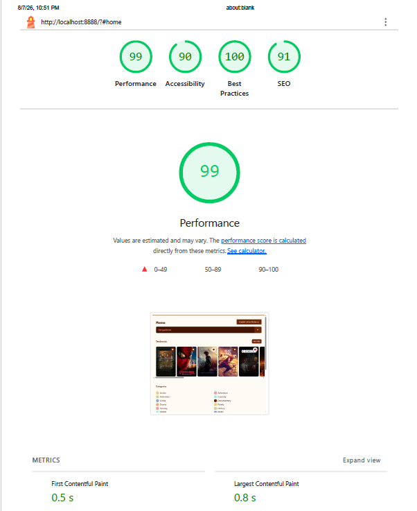

# Movies App

Aplicacion web para explorar peliculas usando la API de [The Movie Database (TMDB)](https://www.themoviedb.org/). Este proyecto fue creado como pieza de portafolio para demostrar integracion con APIs, manipulacion del DOM con JavaScript vanilla, navegacion del lado del cliente, responsive design y practicas de rendimiento web.

## Proposito

El proyecto simula una experiencia de descubrimiento de peliculas en la que una persona puede consultar tendencias, explorar categorias, buscar titulos, revisar detalles y guardar peliculas favoritas.

Ademas de resolver la funcionalidad principal, el proyecto muestra decisiones orientadas a una aplicacion real:

- Separacion entre el frontend estatico y el acceso seguro a TMDB.
- Carga progresiva de imagenes para reducir el trabajo inicial del navegador.
- Navegacion mediante hash sin recargas completas de pagina.
- Interfaz responsive desarrollada desde mobile first.
- Uso de estados visuales de carga y una imagen alternativa cuando un poster falla.

## Funcionalidades

- Consulta de peliculas en tendencia.
- Exploracion de peliculas por categoria.
- Busqueda de peliculas por titulo.
- Vista de detalle con puntuacion, descripcion, categorias y recomendaciones.
- Scroll infinito para tendencias, busquedas y categorias.
- Lazy loading de posters mediante `IntersectionObserver`.
- Selector de idiomas para consultar TMDB en ingles, aleman, portugues, frances y espanol.
- Favoritos persistidos en `localStorage`.
- Navegacion del historial de busquedas mediante una estructura `Stack`.
- Diseno responsive con estilos especificos para pantallas de escritorio.
- Skeleton loading para mejorar la percepcion de rendimiento mientras llegan los datos.
- Imagen de fallback para posters que no se pueden cargar.

## Stack Tecnologico

- HTML5.
- CSS3.
- JavaScript moderno sin framework frontend.
- Axios cargado desde jsDelivr para las peticiones del cliente.
- TMDB API como fuente de peliculas, categorias e imagenes.
- Netlify Functions para proteger e inyectar `TMDB_API_KEY` en las peticiones server-side.
- Google Fonts: Dosis y Red Hat Display.

El frontend no utiliza un bundler ni un proceso de build. Netlify publica directamente el directorio `public`.

## Arquitectura de la API

El frontend no llama directamente a los endpoints de TMDB. Todas las peticiones pasan por:

```text
Frontend -> /api/tmdb -> Netlify Function -> TMDB
```

La funcion `netlify/functions/tmdb.mjs`:

- Solo acepta peticiones `GET`.
- Utiliza `endpoint` para seleccionar una ruta de una lista blanca.
- Soporta rutas estaticas como `search/movie` y `discover/movie`.
- Soporta rutas dinamicas como `movie/{id}` y `movie/{id}/recommendations`.
- Reenvia los demas query parameters hacia TMDB.
- Lee la clave desde `process.env.TMDB_API_KEY`.
- Devuelve el status HTTP original de TMDB.

Ejemplo de busqueda:

```text
GET /api/tmdb?endpoint=searchMovie&query=alien&page=2&language=es-ES
```

Ejemplo de recomendaciones:

```text
GET /api/tmdb?endpoint=movieRecommendations&movieId=50&language=es-ES
```

La clave no debe guardarse en el frontend ni en el repositorio. Para ejecutar la funcion se debe configurar la variable `TMDB_API_KEY` en el entorno local o en Netlify.

## Responsive Design

La interfaz se desarrollo bajo el enfoque **mobile first**. Los estilos base de `public/styles/app.css` priorizan pantallas pequenas y la hoja `public/styles/desktop.css` agrega ajustes a partir de los `700px`.

La adaptacion incluye:

- Grillas fluidas para las tarjetas de peliculas.
- Contenedores con scroll horizontal para recomendaciones.
- Cambio de composicion del header y del detalle de pelicula en escritorio.
- Imagenes y contenido que se ajustan al ancho disponible.
- Navegacion y controles utilizables en pantallas tactiles.

## Rendimiento y Lighthouse

La captura siguiente muestra una medicion de Lighthouse realizada sobre la aplicacion:



Resultados registrados:

| Categoria | Resultado |
| --- | ---: |
| Performance | 99 |
| Accessibility | 90 |
| Best Practices | 100 |
| SEO | 91 |
| First Contentful Paint | 0.5 s |
| Largest Contentful Paint | 0.8 s |

Estos resultados reflejan una ejecucion concreta y pueden variar segun el dispositivo, el navegador, la red y la respuesta de TMDB. Las decisiones que contribuyen al resultado incluyen:

- Lazy loading de imagenes con `IntersectionObserver`.
- Carga de imagenes bajo demanda en lugar de solicitar todos los posters al inicio.
- Skeleton loading para evitar una interfaz vacia durante las peticiones.
- Uso de `alt` en las imagenes de peliculas.
- Meta viewport para adaptar la interfaz a dispositivos moviles.
- Preconexion a los dominios de fuentes externas.
- Separacion de recursos estaticos y peticiones de datos.

## Estructura del Proyecto

```text
.
├── netlify/
│   └── functions/
│       └── tmdb.mjs          # Proxy serverless hacia TMDB
├── public/
│   ├── img/
│   │   ├── error404.png      # Imagen alternativa para posters
│   │   └── metrics.PNG       # Captura de Lighthouse
│   ├── src/
│   │   ├── main.js           # API client, renderizado y favoritos
│   │   ├── navigation.js     # Navegacion por hash y scroll infinito
│   │   ├── nodes.js          # Referencias a nodos del DOM
│   │   └── stack.js          # Estructura Stack para el historial
│   ├── styles/
│   │   ├── app.css           # Estilos base mobile first
│   │   └── desktop.css       # Ajustes para escritorio
│   └── index.html            # Entrada de la aplicacion
├── .env.example              # Nombre de la variable de entorno requerida
├── netlify.toml              # Directorios de publicacion y funciones
├── package.json
└── .gitignore
```

## Ejecucion Local

Para probar el frontend y la funcion serverless se recomienda utilizar Netlify Dev. Primero configura la variable de entorno.

En PowerShell:

```powershell
$env:TMDB_API_KEY="tu_clave_de_tmdb"
npx netlify-cli dev
```

En macOS o Linux:

```bash
TMDB_API_KEY="tu_clave_de_tmdb" npx netlify-cli dev
```

Netlify utilizara la configuracion de `netlify.toml`, publicara `public` y detectara las funciones en `netlify/functions`.

## Despliegue en Netlify

El proyecto esta preparado para conectarse a un repositorio de GitHub y desplegarse automaticamente en Netlify:

1. Conecta el repositorio desde **Import an existing project**.
2. Usa la rama principal como rama de produccion.
3. Configura `TMDB_API_KEY` en las variables de entorno del proyecto.
4. Verifica que el directorio publicado sea `public` y el directorio de funciones sea `netlify/functions`.
5. Cada push a la rama de produccion generara un nuevo despliegue.

No se debe publicar ninguna clave real dentro de `public` ni dentro del repositorio.

## Aprendizajes Demostrados

Este proyecto sirve como evidencia de experiencia practica en:

- Consumo y modelado de una API externa.
- Diseno de una pequena arquitectura serverless.
- Manipulacion del DOM y eventos con JavaScript vanilla.
- Persistencia de estado en el navegador.
- Lazy loading, scroll infinito y estados de carga.
- Responsive design con enfoque mobile first.
- Accesibilidad, SEO y optimizacion web basica.
- Organizacion de recursos estaticos y separacion de responsabilidades.
